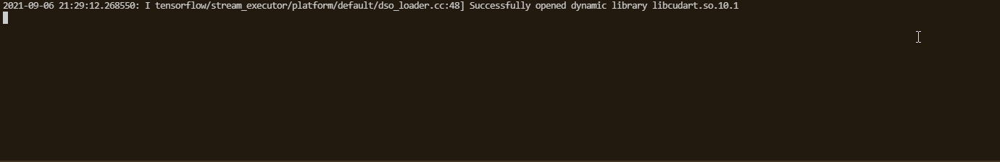
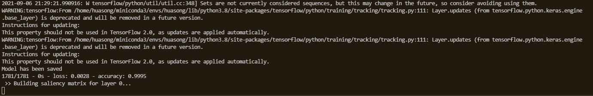
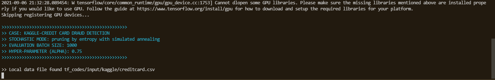

Our python code can run pruning progressively and evaluate robustness automatically. The code is written and tested through Microsoft VS Code.

The execution environment of the experiments on paper is summarised as follows: 
* Tensorflow 2.3.0 (Anaconda, tensorflow-gpu version)
* Python 3.8
* Ubuntu 20.04 LTS

You may run our demonstrative source code to perform training and pruning of all six models in one run, which is exactly same with our experiment (the root path of this project is "src/"):

* src/tf_codes/quick_benchmark.py

You may also execute one of the following source code to run the pruning with FGSM robustness evaluation after each iteration (it may run for a few hours), depending on which dataset & model you would like to try:

> Please be noted in each python/bash file, there is an argument called "benchmarking". You can disable it by setting to 1 to speedup the pruning process. Disabling it (set to 0) will lead a FGSM attack followed by robustness evaluation after each pruning epoch, which could be slow.

You can also run a specific model pruning and robustness evalution by executing an arbitrary file listed below (Tested on Ubuntu 20.04 LTS):

* src/tf_codes/batch_pruning_evaluation_kaggle.sh (Credit Card Fraud, MLP, 2 labels)
* src/tf_codes/batch_pruning_evaluation_chest.sh (Chest X-ray, CNN, 2 labels)
* src/tf_codes/batch_pruning_evaluation_mnist_relu.py (MNIST-ReLU, MLP, 10 labels)
* src/tf_codes/batch_pruning_evaluation_mnist_sigmoid.py (MNIST-Sigmoid, MLP, 10 labels)
* src/tf_codes/batch_pruning_evaluation_cifar_relu.py (CIFAR-10-ReLU, CNN, 10 labels)
* src/tf_codes/batch_pruning_evaluation_cifar_sigmoid.py (CIFAR-10-Sigmoid, CNN, 10 labels)

For the first time execution, our code will train a normal model. As shown in the figure below.

Once the model is trained and saved, our program will start pruning immediately. In case the benchmarking mode is set on, we only perform pruning without robustness assessment. Like the figure shown below.

You can manually set benchmarking off to run a robustness assessment based on FGSM per step during the pruning. Each time we will generate adversarial samples for 1000 test images/data, and then output the number of robust instances, as the meansurement of robustness preservation.

In addition, we also evaluate the robustness in top-K mode (K=3 in our implementation), you may try to run codes below:

* src/tf_codes/batch_pruning_evaluation_cifar_top3_relu.py (CIFAR-10-ReLU, CNN, 10 labels)
* src/tf_codes/batch_pruning_evaluation_cifar_top3_sigmoid.py (CIFAR-10-Sigmoid, CNN, 10 labels)

All the models trained and pruned will be saved in tf_codes/model directory.

All the log files recording the pruning details at each step, accuracy and robustness assessment (if not in benchmarking mode) are saved with time stamp in filename in tf_codes/logs directory.

You can also donwload the source code as a ZIP package through the sharing link below (the zipped file contains offline datasets so that it will save your time at the first time execution, while training the original models):

* https://seto.teracloud.jp/share/1191927ec22cffc3 (apprx. 2.9MB, w/o dataset) OR
* https://seto.teracloud.jp/share/1191b3ba6777ead3 (apprx. 1.21GB, with Crdit Card Fraud Detection & Chest X-ray dataset)

(You don't have to log in to download, just click "continue without logging in" at the bottom)
